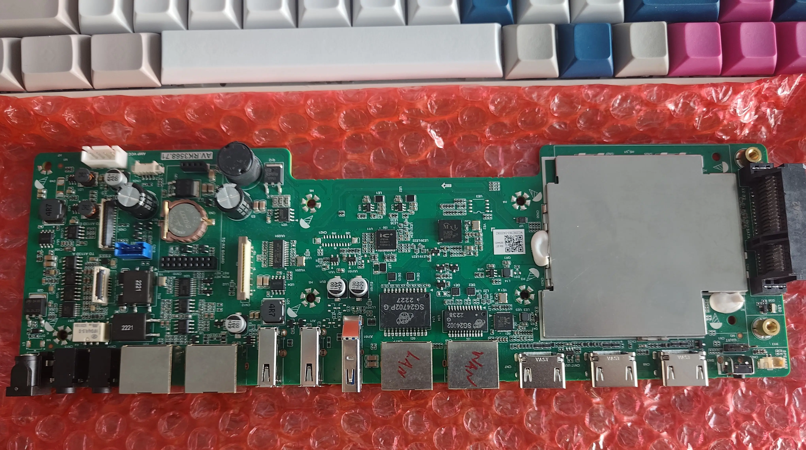

# Seewo SV21 (RK3568) — CPU / WAN / LAN 修复固件

本仓库（fork 自 [blacksamuraiiii/seewo-sv21-rk3568](https://github.com/blacksamuraiiii/seewo-sv21-rk3568)）在 Kwrt/OpenWrt 基础上，**修复了希沃 SV21 的三个设备树问题：CPU 锁频、LAN 口（板载/PoE）不起、WAN 口（RTL8153）不枚举**。修复仅改设备树，已开源在本仓库 `dtb/`。

> **上游致谢**：固件基于 [Kwrt / OpenWrt by @Kiddin9](https://github.com/kiddin9/Kwrt)，在线定制见 [openwrt.ai](https://openwrt.ai)，SV21 官方下载目录 <https://dl.openwrt.ai/firmware/rockchip-armv8/seewo_sv21/>。  
> 同时感谢 [blacksamuraiiii](https://github.com/blacksamuraiiii/seewo-sv21-rk3568)、[P3TERX](https://github.com/P3TERX/P3TERX)、[coolsnowwolf/lede](https://github.com/coolsnowwolf/lede) 提供的支持与构建脚手架。

## 📥 直接下载（已修复版）

到 [**Releases**](../../releases) 下载 `kwrt-...-seewo_sv21-squashfs-sysupgrade.img.gz`，用 LuCI 或 `sysupgrade -n` 刷入即可。

## ✅ 修复内容

| 问题 | 上游现象 | 修复 |
|---|---|---|
| CPU 锁频 | fan53555 `Chip ID 8 not supported`，锁 816MHz | `vdd_cpu` = `silergy,syr827` → **1.992GHz** |
| LAN 口（GMAC1） | 板载/PoE 口链路不起 | 补 `fixed-link` |
| WAN 口（RTL8153） | 内部 USB 千兆不枚举、无 eth1 | 设备树 USB 配置修正 → eth1 恢复 |
| NPU | 上游不支持 | 仍不可用（主线 Linux 不支持 RK3568 NPU） |

## 已验证 DTB

- `dtb/kwrt-25.12-snapshot-6.12.92-v3-oldusb/`：用于 Kwrt 25.12-SNAPSHOT / 内核 6.12.92 的 SV21 设备树。已在实机验证：CPU 调频恢复到 1992MHz、RTL8153 WAN 恢复为 `eth1`、LAN/PoE 口正常。
- 自行合成：把该 `rockchip.dtb` 替换原版 Kwrt 镜像 boot 分区的同名文件即可（见各 Release 的 RELEASE_NOTES）。

## ⚠️ 刷机须知

- sysupgrade 会**整盘重写 eMMC**，原有 `/opt` 等数据分区会被抹除，刷前务必备份。
- 不要勾选“保留配置”；备好 MaskROM 救砖（loader：`rk356x_spl_loader_ddr1056_v1.12.109_no_check_todly.bin`）。
- 依赖与刷机工具见 `depends-ubuntu-2004`、`RK3568刷机教程.docx`。

